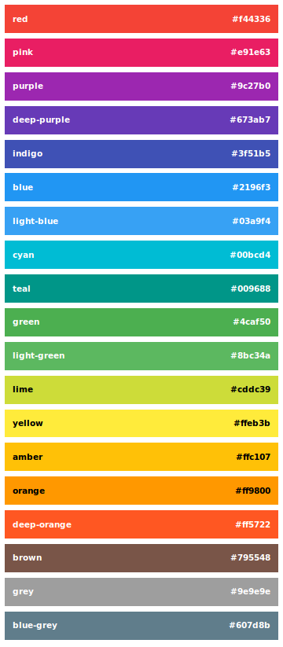

#material-colors.css

`material-colors.css` bring all material design palette colors to your text, background and border.

##Usage
To use material-colors.css in your website, simply drop the stylesheet into your document's `<head>`, and add the class `{color}-text` or `bg-{color}` or `border-{color}` to an element, along with any of the color names. That's it!

```html
<head>
 <link rel="stylesheet" href="material-colors.min.css">
</head>
```

You can use material-colors.css with Bootstrap or all other CSS frameworks. Bootstrap button :

```html
<button class="btn bg-indigo">
  <b>Button Indigo</b>
</button>
```

## Palette



## Custom Builds
material-colors.css is powered by [Grunt](http://gruntjs.com), and you can create custom builds pretty easily. First of all, you’ll need Grunt and all other dependencies:

```sh
$ cd path/to/material-colors.css/
$ sudo npm install
```

Next, run `grunt watch` to watch for changes and compile your custom builds.

## License
material-colors.css is licensed under the MIT license. (http://opensource.org/licenses/MIT)
